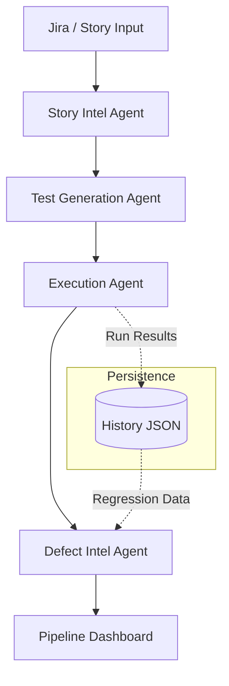
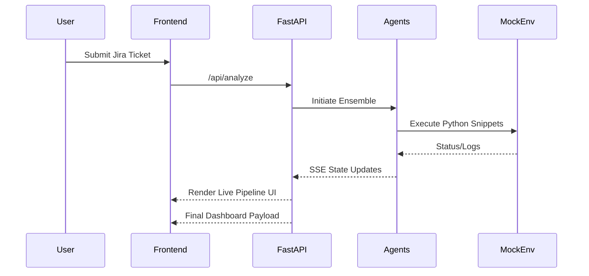

<div align="center">
  <svg viewBox="0 0 24 24" width="80" height="80" fill="none" stroke="#6366f1" stroke-width="2">
    <path d="M12 2L3 7v10l9 5 9-5V7l-9-5z" />
    <path d="M9 12l2 2 4-4" stroke-linecap="round" stroke-linejoin="round" />
  </svg>
  <h1>IronTest Autonomous QA</h1>
  <p><strong>Transform fragmented Jira stories into production-ready test suites in seconds.</strong></p>

  <p>
    **Thanks to Team ATOS for giving us this opportunity.**
  </p>

  <p>
    <a href="https://reactjs.org/"></a>
    <a href="https://fastapi.tiangolo.com/"></a>
    <a href="https://tailwindcss.com/"></a>
    <a href="https://groq.com/"></a>
  </p>
</div>

---

## 🚀 The Problem We Solved
QA is often the last major bottleneck before shipping to production. Writing comprehensive tests takes time, and edge cases are frequently missed. We built **IronTest** to automate the QA engineering lifecycle. Our goal was to take raw human intent—like a Jira ticket—and automatically generate test cases, edge case scenarios, and automation code snippets, ultimately giving a confidence score for deployment.

## 🧠 How It Works
We designed IronTest around four specialized agents that handle the full autonomous QA lifecycle:

1.  **[Story Agent](docs/story_agent.md)**: Parses user stories or Jira tickets to extract modules, requirements, and acceptance criteria.
2.  **[Test Agent](docs/test_agent.md)**: Generates comprehensive test vectors (functional, boundary, edge-case) and executable Python snippets.
3.  **[Execution Agent](docs/execution_agent.md)**: Runs generated tests in a secure, isolated environment with intelligent stubs to handle external dependencies.
4.  **[Defect Agent](docs/defect_agent.md)**: Analyzes execution results against **Historical Run Data** to calculate regression risk and deployment confidence.

## 🏢 Enterprise & DevOps Integration
IronTest is built to fit into the modern enterprise stack:
- **Jira / Azure DevOps**: Native ingestion of requirements via URL and Token.
- **CI/CD Webhooks**: Trigger an autonomous multi-agent analysis directly from a GitHub Action or Jenkins pipeline.
- **Historical DB**: Persistently tracks every test run to detect long-term stability trends and regressions.

> 📚 Check out the [docs/](./docs/) directory for an in-depth look at our architecture and agent design.

## 🎨 Premium UI Engine
Internal developer tools don't have to be ugly. The IronTest interface is designed for a high-fidelity automation experience:
- **Typing Hero Effect**: Dynamic "type & retract" header for a live-terminal aesthetic.
- **Hexagon-Check Branding**: Custom vector logo symbolizing stability and algorithmic precision.
- **Live Selection Glow**: Active indicators for preset stories providing instant context feedback.
- **Surgical Iconography**: Custom SVG sun/moon tokens for a seamless Dark/Light mode transition.
- **Stream-First UX**: Zero-latency status updates via Framer Motion and SSE.

## ⚡ Getting Started
### Prerequisites
- Python 3.12+ 
- Node.js 20+
- A valid `GROQ_API_KEY`

### 1. Backend Spin-up
```bash
cd backend
python -m venv .venv
source .venv/bin/activate  # Or .venv\Scripts\activate on Windows
pip install -r requirements.txt
export GROQ_API_KEY="your-api-key"
python -m uvicorn main:app --reload
```

### 2. Frontend Spin-up
```bash
cd frontend
npm install
npm run dev
```

Navigate to `http://localhost:5173` to explore IronTest locally.

## 📊 Technical Flow


## 🎮 Deployment Lifecycle


## 🏆 Built for the Hackathon
We built IronTest to bridge the gap between product management intent and engineering reality, providing a tangible way to speed up the CI/CD pipeline while maintaining high quality. 
