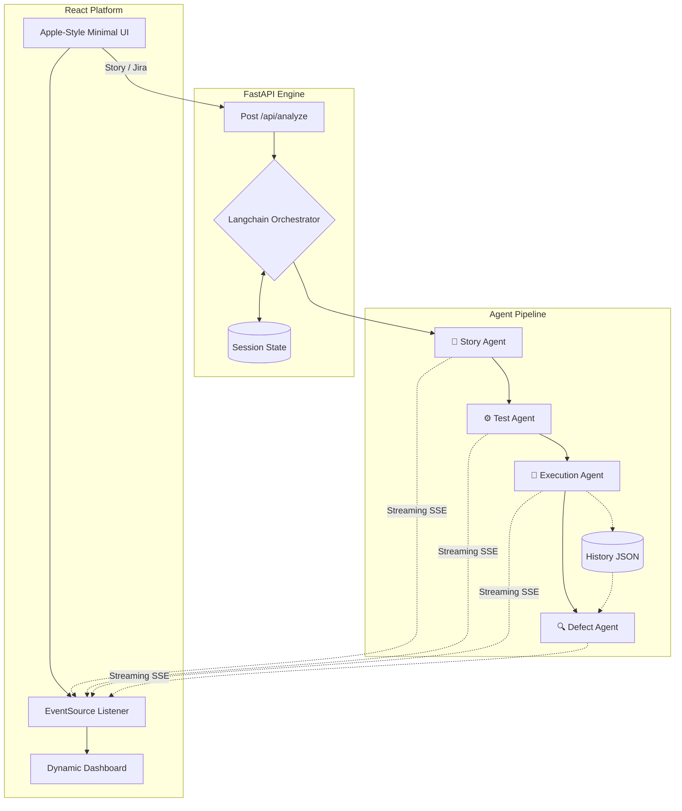

# IronTest System Architecture

## Overview
We built IronTest to tackle the manual QA bottleneck by converting raw user stories into actionable test suites and identifying potential risk areas. We went with a React frontend and a FastAPI backend to easily handle real-time streaming from our LLM agents.

## Architecture Topology

## How the Pieces Fit Together
1. **The Entry Point**: The user submits a story or ticket (via Jira URL) through the React frontend. This payload hits the FastAPI backend.
2. **The Orchestrator**: The backend spins up an async orchestration session. We use Server-Sent Events (SSE) to stream live state updates back to the frontend.
3. **Agent Pipeline**:
   - **Story Agent**: Parses raw requirements into structured JSON.
   - **Test Agent**: Generates specific test vectors and executable code.
   - **Execution Agent**: Runs the code in a mocked subprocess environment.
   - **Defect Agent**: Aggregates results and compares them with **Historical Trends** to provide a final deployment verdict.
4. **Data Persistence**: Successful and failed runs are persisted to a `history.json` database, allowing the system to learn from regression trends over time.
5. **Data Visualization**: The final results are rendered in an interactive dashboard with heatmaps and failure logs.

## Technology Stack
- **Frontend**: React, Tailwind CSS, Framer Motion, Vite.
- **Backend**: Python 3.12, FastAPI, Pydantic, HTTPX.
- **AI Integration**: Groq API (Llama 3) with structured JSON extraction to ensure consistent agent outputs.
