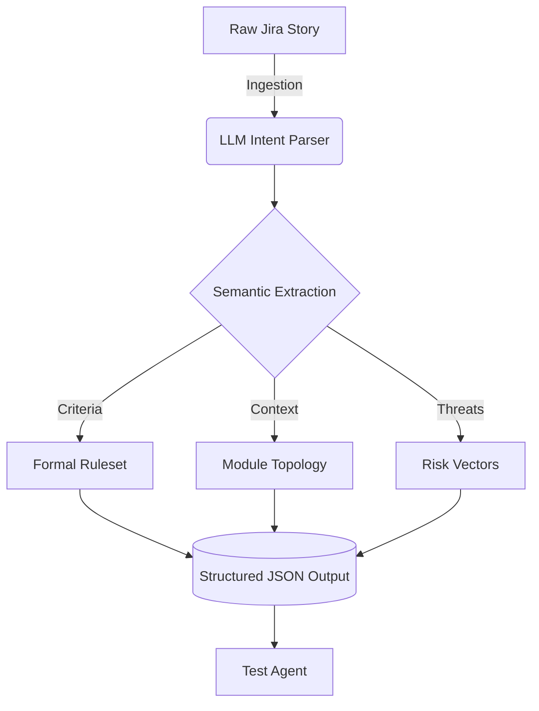

# Story Agent

## Overview
The **Story Agent** kicks off the IronTest pipeline. We designed it to take unstructured text—like a messy Jira ticket or PR description—and parse it into a structured format that the rest of our system can rely on. 

## Core Responsibilities
1. **Requirements Parsing**: Uses an LLM to read the user story and figure out what the actual feature or change is.
2. **Acceptance Criteria Extraction**: Pulls out specific acceptance criteria to define what "done" actually looks like.
3. **Impact Mapping**: Tries to figure out which modules, databases, or APIs will be affected by the change.
4. **Risk Identification**: Flags obvious risks early on (for example, pointing out that adding a new 3rd-party API call might introduce latency).

## Technical Flow

## How We Built It
To make this work reliably, we heavily constrained the prompt. We force the LLM to output valid JSON with specific keys for `modules`, `core_intent`, `acceptance_criteria`, and `risk_factors`. This step is crucial because down the line, our other agents need clean, structured data to work properly.
